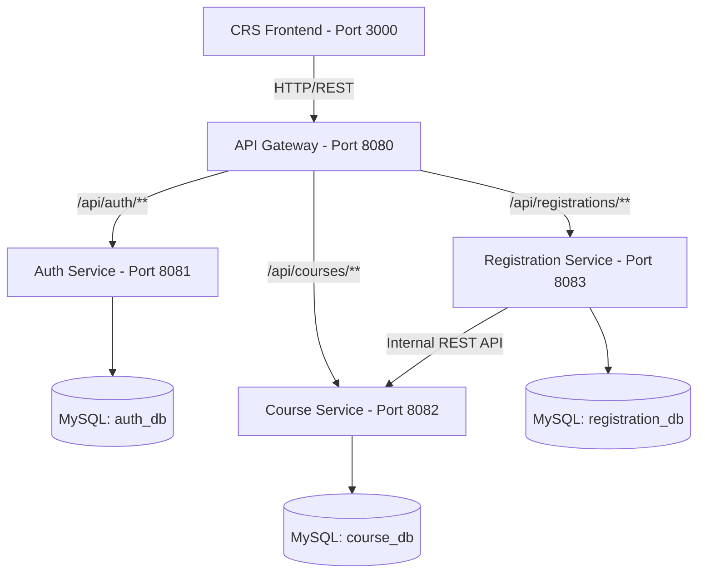

# Owner information
Name : Nguyễn Văn Hiếu
Class : DH13C8


---

## CRS Microservices - Course Registration System

Hệ thống Đăng ký Học phần (Course Registration System - CRS) được thiết kế và phát triển dựa trên kiến trúc Microservices, đáp ứng khả năng mở rộng (scalability), cô lập dữ liệu (data isolation) và độ tin cậy cao.

---

## Mục lục nội dung
- [Tổng quan Kiến trúc](#tổng-quan-kiến-trúc)
- [Danh sách Microservices](#danh-sách-microservices)
- [Công nghệ sử dụng](#công-nghệ-sử-dụng)
- [Cấu trúc dự án](#cấu-trúc-dự-án)
- [Nguyên tắc Thiết kế & Dữ liệu](#nguyên-tắc-thiết-kế--dữ-liệu)
- [Danh sách API Specification](#danh-sách-api-specification)
- [Cấu hình Môi trường (.env)](#cấu-hình-môi-trường-env)
- [Hướng dẫn Khởi chạy](#hướng-dẫn-khởi-chạy)

---

## Tổng quan Kiến trúc

Hệ thống bao gồm 4 microservices backend và 1 ứng dụng web frontend, giao tiếp thông qua RESTful APIs và được quản lý bởi API Gateway làm đầu mối truy cập duy nhất.



---

## Danh sách Microservices

| Component | Port | Database | Trách nhiệm chính |
| :--- | :---: | :---: | :--- |
| **`api-gateway`** | `8080` | *(Không có DB)* | Điểm vào duy nhất (Single Entry Point), định tuyến (Routing), CORS, xác thực token JWT |
| **`auth-service`** | `8081` | `auth_db` | Quản lý Người dùng/Sinh viên, Đăng nhập, Đăng ký, phát hành & xác thực JWT |
| **`course-service`** | `8082` | `course_db` | Quản lý Môn học, Tìm kiếm, Phân trang, Quản lý số chỗ (reserve/release seat) |
| **`registration-service`** | `8083` | `registration_db` | Quản lý Đăng ký học phần, gọi API nội bộ sang `course-service` để trừ/hoàn chỗ |
| **`crs-frontend`** | `3000` | - | Giao diện người dùng Web Application tương tác với hệ thống |

---

## Công nghệ sử dụng

- **Backend Framework**: Java 21, Spring Boot 3+, Spring Data JPA, Spring Cloud Gateway, Spring Security
- **Authentication & Security**: JSON Web Token (JWT)
- **Database**: MySQL 8.x (Database per Service pattern)
- **Frontend**: Web Application (React / Modern JS Framework)
- **DevOps & Tooling**: Maven, Docker, Docker Compose, `.env` Configuration management

---

## Cấu trúc dự án

```text
crs-microservices/
├── api-gateway/          # Microservice API Gateway (Port 8080)
├── auth-service/         # Microservice Auth & User Management (Port 8081)
├── course-service/       # Microservice Course Management (Port 8082)
├── registration-service/ # Microservice Registration Management (Port 8083)
├── crs-frontend/         # Frontend Web Application (Port 3000)
├── docs/                 # Tài liệu thiết kế hệ thống & Blueprint API
│   ├── blueprint-api.md                 # Chi tiết danh sách API endpoints
│   └── thiet-ke-bien-gioi-service.md    # Nguyên tắc ranh giới service & routing
├── .env                  # Cấu hình biến môi trường (Database, Ports, JWT)
├── .gitignore            # Cấu hình loại trừ Git
└── README.md             # Tài liệu tổng quan hệ thống
```

---

## Nguyên tắc Thiết kế & Dữ liệu

1. **Data Ownership (Quyền sở hữu dữ liệu)**:
   - Mỗi Microservice quản lý một Database riêng biệt (`auth_db`, `course_db`, `registration_db`).
   - Không có service nào được quyền truy cập trực tiếp vào Database của service khác.
2. **Inter-Service Communication**:
   - Mọi tương tác dữ liệu giữa các service đều phải thực hiện qua REST API nội bộ (ví dụ: `registration-service` gọi `PATCH /internal/courses/{id}/reserve-seat` của `course-service`).
3. **Gateway Routing Table**:
   - `/api/auth/**` -> `http://localhost:8081` *(Public login/register, phần còn lại yêu cầu JWT)*
   - `/api/courses/**` -> `http://localhost:8082` *(GET Public, POST/PUT/DELETE yêu cầu Role ADMIN)*
   - `/api/registrations/**` -> `http://localhost:8083` *(Yêu cầu JWT với Role STUDENT/ADMIN)*

---

## Danh sách API Specification

### 1. Auth Service (`8081`)
- `POST /auth/login` : Đăng nhập & trả về JWT *(Public)*
- `POST /auth/register` : Đăng ký tài khoản *(Public)*

### 2. Course Service (`8082`)
- `GET /courses` : Danh sách môn học, tìm kiếm & phân trang *(Public)*
- `GET /courses/{id}` : Chi tiết thông tin môn học *(Public)*
- `POST /courses` : Thêm môn học mới *(ADMIN)*
- `PUT /courses/{id}` : Cập nhật môn học *(ADMIN)*
- `DELETE /courses/{id}` : Xóa môn học *(ADMIN)*
- `PATCH /internal/courses/{id}/reserve-seat` : Trừ số chỗ còn lại khi đăng ký *(API Nội bộ)*
- `PATCH /internal/courses/{id}/release-seat` : Hoàn trả lại số chỗ khi hủy đăng ký *(API Nội bộ)*

### 3. Registration Service (`8083`)
- `POST /registrations` : Đăng ký môn học *(STUDENT)*
- `GET /registrations/my` : Xem danh sách môn học đã đăng ký *(STUDENT)*
- `DELETE /registrations/{id}` : Hủy đăng ký môn học *(STUDENT / ADMIN)*

---

## Cấu hình Môi trường (.env)

File `.env` nằm tại thư mục gốc chứa các thông số cấu hình chính (lưu ý: không commit thông tin mật thực tế lên Git):

```env
# Database Credentials
DB_USERNAME=root
DB_PASSWORD=your_mysql_password

# Port Configurations
API_GATEWAY_PORT=8080
AUTH_SERVICE_PORT=8081
COURSE_SERVICE_PORT=8082
REGISTRATION_SERVICE_PORT=8083

# JWT Security (Thay thế bằng chuỗi khóa bí mật của bạn, tối thiểu 256 bits)
JWT_SECRET=your_jwt_secret_key_at_least_256_bits_length_string
JWT_EXPIRATION=86400000
```

---

## Hướng dẫn Khởi chạy (Local Development)

### Yêu cầu tiền đề
- **Java**: JDK 21+
- **Maven**: 3.8+ (hoặc sử dụng Maven Wrapper `mvnw` / `mvnw.cmd` có sẵn)
- **MySQL**: 8.0+

### Các bước thực hiện

1. **Khởi tạo Database MySQL**:
   ```sql
   CREATE DATABASE IF NOT EXISTS auth_db;
   CREATE DATABASE IF NOT EXISTS course_db;
   CREATE DATABASE IF NOT EXISTS registration_db;
   ```

2. **Cấu hình biến môi trường**:
   - Cập nhật thông tin tài khoản MySQL (`DB_USERNAME`, `DB_PASSWORD`) trong file `.env`.

3. **Chạy các Microservices**:
   Mở từng terminal cho mỗi microservice và khởi chạy theo thứ tự khuyến nghị (sử dụng `./mvnw` trên Linux/macOS/Git Bash hoặc `mvnw.cmd` trên Windows Command Prompt/PowerShell):
   ```bash
   # 1. Chạy Auth Service
   cd auth-service && ./mvnw spring-boot:run

   # 2. Chạy Course Service
   cd course-service && ./mvnw spring-boot:run

   # 3. Chạy Registration Service
   cd registration-service && ./mvnw spring-boot:run

   # 4. Chạy API Gateway
   cd api-gateway && ./mvnw spring-boot:run
   ```

4. **Chạy Frontend**:
   ```bash
   cd crs-frontend
   npm install
   npm run dev
   ```

