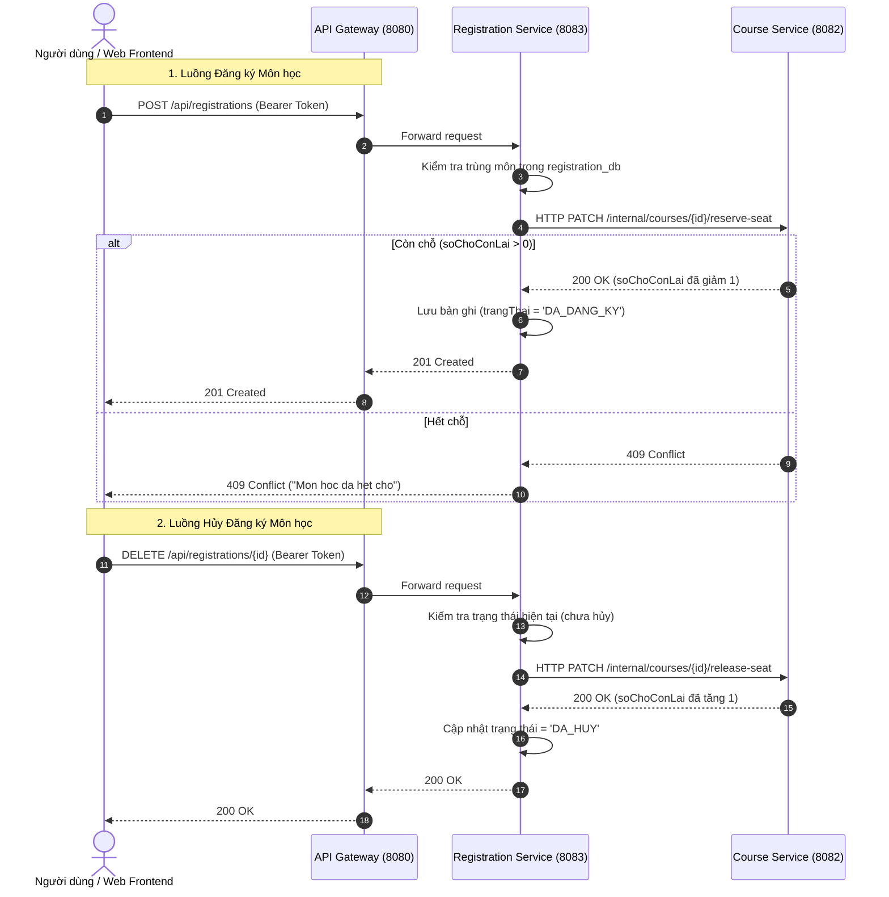

# Owner information
- **Họ và tên**: Nguyễn Văn Hiếu
- **Lớp**: DH13C8
- **MSSV**: 2311063323

---

# Hệ thống Đăng ký Học phần - CRS Microservices (Course Registration System)

Hệ thống Đăng ký Học phần (**Course Registration System - CRS**) được thiết kế và xây dựng theo kiến trúc **Microservices** kết hợp **Single Page Application (SPA)** phía Client. Dự án đáp ứng các tiêu chuẩn kiến trúc hiện đại: khả năng mở rộng (**Scalability**), cô lập dữ liệu hoàn toàn (**Database per Service**), mô hình bảo mật 2 tầng (**2-Layer Security & RBAC**), và tích hợp API Gateway với cấu hình CORS cho Web Frontend.

---

## Mục lục nội dung

1. [Tổng quan Kiến trúc Hệ thống](#tổng-quan-kiến-trúc-hệ-thống)
2. [Danh sách Service & Ứng dụng](#danh-sách-service--ứng-dụng)
3. [Công nghệ sử dụng](#công-nghệ-sử-dụng)
4. [Cấu trúc Thư mục Dự án](#cấu-trúc-thư-mục-dự-án)
5. [Nguyên tắc Thiết kế & Bảo mật](#nguyên-tắc-thiết-kế--bảo-mật)
6. [Định tuyến API Gateway & CORS](#định-tuyến-api-gateway--cors)
7. [Tổng quan Hợp đồng API (API Contracts)](#tổng-quan-hợp-đồng-api-api-contracts)
8. [Giao tiếp nội bộ giữa các Service (Inter-Service Communication)](#giao-tiếp-nội-bộ-giữa-các-service-inter-service-communication)
9. [Cấu hình Môi trường (.env)](#cấu-hình-môi-trường-env)
10. [Hướng dẫn Cài đặt & Khởi chạy (Local Development)](#hướng-dẫn-cài-đặt--khởi-chạy-local-development)
11. [Dữ liệu Khởi tạo & Tài khoản Mẫu](#dữ-liệu-khởi-tạo--tài-khoản-mẫu)
12. [Kịch bản Kiểm thử Hệ thống (Test Scenarios)](#kịch-bản-kiểm-thử-hệ-thống-test-scenarios)
13. [Trạng thái Phát triển & Kế hoạch Tương lai](#trạng-thái-phát-triển--kế-hoạch-tương-lai)

---

## Tổng quan Kiến trúc Hệ thống

Hệ thống bao gồm **1 ứng dụng Frontend (React SPA)**, **4 microservices Backend** và **3 cơ sở dữ liệu MySQL độc lập**. Tất cả các truy cập từ người dùng (Frontend SPA, Mobile, Postman) và Đối tác tích hợp (Partner) đều đi qua **API Gateway** (Cổng 8080) làm điểm truy cập duy nhất (**Single Entry Point**).


---

## Danh sách Service & Ứng dụng

| Thành phần / Service | Vai trò | Port | Database | Trách nhiệm chính |
| :--- | :---: | :---: | :---: | :--- |
| **`crs-frontend`** | Frontend Web SPA | `5173` | *(LocalStorage)* | Giao diện người dùng (React 19 + TypeScript + Vite), gọi API qua Gateway `:8080`, hiển thị danh sách môn học, tương tác xác thực và đăng ký. |
| **`api-gateway`** | API Gateway | `8080` | *(Không DB)* | Điểm truy cập duy nhất, RewritePath routing, cấu hình CORS WebFlux cho Frontend, lọc Auth sơ bộ (AuthHeaderFilter), kiểm tra Partner API Key (ApiKeyFilter). |
| **`auth-service`** | Authentication & User | `8081` | `auth_db` | Quản lý người dùng (`User`, `Student`), mã hóa mật khẩu BCrypt, seed dữ liệu mẫu, đăng nhập (`POST /auth/login`), phát hành JWT Token mang claim `username` & `role`. |
| **`course-service`** | Course Management | `8082` | `course_db` | Quản lý môn học (CRUD, tìm kiếm theo từ khóa, phân trang), tự xác thực JWT & RBAC (chỉ `ADMIN` có quyền thêm/sửa/xóa), cung cấp API nội bộ điều phối chỗ (`/internal/**`). |
| **`registration-service`** | Registration Management | `8083` | `registration_db` | Quản lý thông tin đăng ký học phần, kiểm tra trùng môn, tự xác thực JWT, gọi HTTP REST nội bộ sang `course-service` để giữ/trả chỗ tự động, cập nhật trạng thái (`DA_DANG_KY`, `DA_HUY`). |

---

## Công nghệ sử dụng

### 1. Frontend
- **Framework & Build tool**: React 19, TypeScript, Vite 8
- **HTTP Client**: Axios (cấu hình `baseURL` trỏ về API Gateway)
- **Routing**: React Router DOM 7
- **Linting & Code Quality**: ESLint 10, TypeScript ESLint

### 2. Backend & Microservices
- **Platform & Framework**: Java 21, Spring Boot 4.1.0 / 3.x
- **API Gateway**: Spring Cloud Gateway Server WebFlux (Reactive non-blocking, Global CORS)
- **Security & Authentication**: Spring Security, JSON Web Token (`jjwt` 0.12.6), BCrypt Password Encoder
- **Persistence & ORM**: Spring Data JPA, Hibernate, MySQL Connector/J
- **Dev Tools & Utilities**: Lombok, Jakarta Validation (`spring-boot-starter-validation`)

### 3. Cơ sở dữ liệu & Kiến trúc
- **Database Engine**: MySQL 8.x
- **Kiến trúc Dữ liệu**: Pattern *Database per Service* (3 schema độc lập: `auth_db`, `course_db`, `registration_db`)
- **Giao tiếp liên dịch vụ (Inter-service)**: Synchronous HTTP REST thông qua Spring `RestTemplate`
- **Quản lý cấu hình**: File `.env` dùng chung qua cơ chế `spring.config.import`

---

## Cấu trúc Thư mục Dự án

```text
crs-microservices/
├── api-gateway/                      # Microservice API Gateway (Port 8080)
│   ├── src/main/java/vn/edu/crs/apigateway/
│   │   ├── filter/
│   │   │   ├── ApiKeyFilter.java      # Bộ lọc kiểm tra X-API-KEY cho đối tác
│   │   │   └── AuthHeaderFilter.java  # Bộ lọc sơ kiểm header Authorization
│   │   └── ApiGatewayApplication.java
│   └── src/main/resources/application.yml # Cấu hình Routes và WebFlux CORS
│
├── auth-service/                     # Microservice Xác thực & Người dùng (Port 8081)
│   ├── src/main/java/vn/edu/crs/authservice/
│   │   ├── config/DataSeeder.java     # Khởi tạo tài khoản mẫu (admin, student1)
│   │   ├── controller/AuthController.java
│   │   ├── entity/User.java, Student.java
│   │   ├── security/JwtUtil.java      # Tạo và ký JWT Token
│   │   └── service/AuthService.java
│   └── src/main/resources/application.properties
│
├── course-service/                   # Microservice Quản lý Môn học (Port 8082)
│   ├── src/main/java/vn/edu/crs/courseservice/
│   │   ├── controller/
│   │   │   ├── CourseController.java         # Public & Admin APIs
│   │   │   └── InternalCourseController.java # API nội bộ (/internal/courses/**)
│   │   ├── entity/Course.java
│   │   ├── security/JwtAuthFilter.java       # Tự verify JWT & trích xuất Role
│   │   └── service/CourseService.java
│   └── src/main/resources/application.properties
│
├── registration-service/             # Microservice Đăng ký Học phần (Port 8083)
│   ├── src/main/java/vn/edu/crs/registrationservice/
│   │   ├── client/CourseClient.java          # RestTemplate gọi sang course-service
│   │   ├── controller/RegistrationController.java
│   │   ├── entity/Registration.java
│   │   ├── security/JwtAuthFilter.java       # Tự verify JWT
│   │   └── service/RegistrationService.java
│   └── src/main/resources/application.properties
│
├── crs-frontend/                     # Frontend Web Single Page Application (Port 5173)
│   ├── src/
│   │   ├── api/
│   │   │   ├── axiosClient.ts        # Axios instance trỏ về Gateway :8080
│   │   │   └── courseApi.ts          # API calls lấy danh sách môn học
│   │   ├── types/                    # TypeScript interfaces (Course, Auth, Registration)
│   │   ├── App.tsx                   # Component giao diện chính
│   │   └── main.tsx
│   ├── .env                          # VITE_API_BASE_URL=http://localhost:8080
│   └── package.json
│
├── docs/                             # Tài liệu kỹ thuật chi tiết
│   ├── blueprint-api.md              # Hợp đồng API chi tiết (Payload, Status code)
│   └── thiet-ke-bien-gioi-service.md # Thiết kế ranh giới Service & Sequence diagrams
│
├── .env                              # Biến môi trường chung cho toàn bộ Backend
├── .gitignore
└── README.md                         # Tài liệu hướng dẫn tổng quan dự án
```

---

## Nguyên tắc Thiết kế & Bảo mật

### 1. Cô lập Dữ liệu (Data Isolation & Database per Service)
- Mỗi microservice quản lý một CSDL hoàn toàn độc lập (`auth_db`, `course_db`, `registration_db`).
- **Không truy vấn chéo** (No cross-database query): Không một service nào được đọc/ghi trực tiếp vào DB của service khác.
- **Không thiết lập JPA Relationship xuyên service**: Các entity chỉ tham chiếu nhau thông qua ID (`studentId`, `courseId`) dưới dạng kiểu số (`Long`), không sử dụng `@ManyToOne` hay `@OneToMany` xuyên dịch vụ.

### 2. Mô hình Bảo mật 2 Tầng (2-Layer Security)
- **Tầng 1 - API Gateway**:
  - `AuthHeaderFilter`: Kiểm tra sự tồn tại của header `Authorization` đối với các protected routes (`POST/PUT/DELETE /api/courses`, `/api/registrations/**`). Trả về ngay `401 Unauthorized` nếu thiếu.
  - `ApiKeyFilter`: Kiểm tra header `X-API-KEY` đối với route tích hợp đối tác `/api/public/courses`. Trả về ngay `403 Forbidden` nếu thiếu hoặc sai key.
  - *Gateway không thực hiện giải mã chi tiết nội dung JWT để duy trì hiệu năng cao.*
- **Tầng 2 - Business Microservices (`course-service`, `registration-service`)**:
  - Mỗi service được trang bị `JwtAuthFilter` riêng để tự giải mã chữ ký HMAC-SHA256, kiểm tra tính hợp lệ và trích xuất `username`/`role`.
  - Phân quyền theo vai trò (RBAC) tại `course-service`: Chỉ user có Role `ADMIN` mới được gọi các phương thức sửa đổi dữ liệu môn học (`POST`, `PUT`, `DELETE /courses/**`). User mang Role `STUDENT` sẽ nhận mã lỗi `403 Forbidden`.

### 3. Ranh giới API Nội bộ (Internal API Boundary)
- Các endpoint phục vụ trao đổi server-to-server (`/internal/**`) hoàn toàn **không được định tuyến qua Gateway**.
- Client bên ngoài không thể truy cập trực tiếp các API này, đảm bảo tính toàn vẹn nghiệp vụ.

---

## Định tuyến API Gateway & CORS

### 1. Bảng Định tuyến Routes (RewritePath)

Tất cả các yêu cầu từ Client gửi tới Gateway `:8080` sẽ được ánh xạ tới các Microservice tương ứng:

| Endpoint External (Client gọi qua Gateway) | Target Internal Service | Phương thức | Điều kiện xác thực |
| :--- | :--- | :---: | :--- |
| `POST /api/auth/login` | `http://localhost:8081/auth/login` | `POST` | Public (Không cần JWT) |
| `GET /api/courses` | `http://localhost:8082/courses` | `GET` | Public (Không cần JWT) |
| `GET /api/courses/{id}` | `http://localhost:8082/courses/{id}` | `GET` | Public (Không cần JWT) |
| `POST /api/courses` | `http://localhost:8082/courses` | `POST` | Gateway: Cần `Authorization`<br>Course-service: Cần Role `ADMIN` |
| `PUT /api/courses/{id}` | `http://localhost:8082/courses/{id}` | `PUT` | Gateway: Cần `Authorization`<br>Course-service: Cần Role `ADMIN` |
| `DELETE /api/courses/{id}` | `http://localhost:8082/courses/{id}` | `DELETE` | Gateway: Cần `Authorization`<br>Course-service: Cần Role `ADMIN` |
| `POST /api/registrations` | `http://localhost:8083/registrations` | `POST` | Gateway: Cần `Authorization`<br>Registration-service: Authenticated (`ADMIN`/`STUDENT`) |
| `GET /api/registrations/student/{id}` | `http://localhost:8083/registrations/student/{id}` | `GET` | Gateway: Cần `Authorization`<br>Registration-service: Authenticated |
| `DELETE /api/registrations/{id}` | `http://localhost:8083/registrations/{id}` | `DELETE` | Gateway: Cần `Authorization`<br>Registration-service: Authenticated |
| `GET /api/public/courses` | `http://localhost:8082/courses` | `GET` | Yêu cầu Header `X-API-KEY: crs-partner-key-2026` |

### 2. Cấu hình CORS WebFlux
API Gateway đã được cấu hình CORS toàn cục để cho phép Frontend Single Page Application (chạy tại `http://localhost:5173`) gọi API an toàn:
- `allowedOrigins`: `http://localhost:5173`
- `allowedMethods`: `GET, POST, PUT, DELETE, PATCH, OPTIONS`
- `allowedHeaders`: `*`

---

## Tổng quan Hợp đồng API (API Contracts)

> Xem tài liệu chi tiết đầy đủ tại: [docs/blueprint-api.md](file:///D:/crs-microservices/docs/blueprint-api.md).

### 1. Nhóm Xác thực (`auth-service`)
- `POST /api/auth/login`: Nhận `{ username, password }`, phản hồi `{ token, username, role }`.

### 2. Nhóm Môn học (`course-service`)
- `GET /api/courses`: Danh sách môn học có phân trang và tìm kiếm theo `keyword`, `page`, `size`, `sort`.
- `GET /api/courses/{id}`: Chi tiết môn học theo ID.
- `POST /api/courses`: Tạo môn học mới (Yêu cầu Token `ADMIN`).
- `PUT /api/courses/{id}`: Sửa môn học (Yêu cầu Token `ADMIN`).
- `DELETE /api/courses/{id}`: Xóa môn học (Yêu cầu Token `ADMIN`).

### 3. Nhóm Đăng ký Học phần (`registration-service`)
- `POST /api/registrations`: Đăng ký môn học với body `{ studentId, courseId }` (Tự động trừ 1 chỗ tại `course-service`).
- `GET /api/registrations/student/{studentId}`: Lấy danh sách môn học sinh viên đã đăng ký.
- `DELETE /api/registrations/{id}`: Hủy đăng ký học phần (Tự động hoàn trả 1 chỗ tại `course-service`, chuyển trạng thái thành `DA_HUY`).

### 4. Nhóm Đối tác & Nội bộ (Partner & Internal)
- `GET /api/public/courses`: API cho đối tác, yêu cầu Header `X-API-KEY`.
- `PATCH /internal/courses/{id}/reserve-seat`: API nội bộ trừ chỗ khi đăng ký.
- `PATCH /internal/courses/{id}/release-seat`: API nội bộ hoàn chỗ khi hủy đăng ký.

---

## Giao tiếp nội bộ giữa các Service (Inter-Service Communication)

Khi xử lý nghiệp vụ Đăng ký hoặc Hủy đăng ký, `registration-service` điều phối trạng thái dữ liệu thông qua `CourseClient` (Spring `RestTemplate`):



---

## Cấu hình Môi trường (.env)

### 1. Cấu hình Backend (Tệp `.env` tại thư mục gốc)

```env
# Thông tin kết nối MySQL
DB_USERNAME=root
DB_PASSWORD=your_mysql_password

# Cổng khởi chạy các Microservices
API_GATEWAY_PORT=8080
AUTH_SERVICE_PORT=8081
COURSE_SERVICE_PORT=8082
REGISTRATION_SERVICE_PORT=8083

# Cấu hình bảo mật JWT
JWT_SECRET=crs_microservices_secret_key_2026_0123456789_super_secure
JWT_EXPIRATION=86400000

# Khóa bí mật cho API Đối tác
PARTNER_API_KEY=crs-partner-key-2026
```

### 2. Cấu hình Frontend (Tệp `crs-frontend/.env`)

```env
VITE_API_BASE_URL=http://localhost:8080
```

---

## Hướng dẫn Cài đặt & Khởi chạy (Local Development)

### Yêu cầu Tiên quyết
- **Java**: Phiên bản JDK 21 trở lên
- **Node.js**: Phiên bản 18+ hoặc 20+ và **npm**
- **Cơ sở dữ liệu**: MySQL Server 8.x đang chạy tại cổng `localhost:3306`

---

### Bước 1: Khởi tạo các Cơ sở dữ liệu MySQL

Mở MySQL Workbench hoặc MySQL CLI và thực thi lệnh:

```sql
CREATE DATABASE IF NOT EXISTS auth_db CHARACTER SET utf8mb4 COLLATE utf8mb4_unicode_ci;
CREATE DATABASE IF NOT EXISTS course_db CHARACTER SET utf8mb4 COLLATE utf8mb4_unicode_ci;
CREATE DATABASE IF NOT EXISTS registration_db CHARACTER SET utf8mb4 COLLATE utf8mb4_unicode_ci;
```

---

### Bước 2: Cấu hình biến môi trường

1. Đảm bảo file `.env` tại thư mục gốc đã điền đúng `DB_USERNAME` và `DB_PASSWORD` của MySQL trên máy bạn.
2. Đảm bảo file `crs-frontend/.env` chứa đúng đường dẫn `VITE_API_BASE_URL=http://localhost:8080`.

---

### Bước 3: Khởi chạy 4 Microservices Backend

Mở 4 cửa sổ Terminal riêng biệt tại thư mục gốc của dự án:

#### Terminal 1: Khởi chạy Auth Service (Port 8081)
```bash
cd auth-service
./mvnw spring-boot:run
# Trên Windows PowerShell / Command Prompt:
# ./mvnw.cmd spring-boot:run
```

#### Terminal 2: Khởi chạy Course Service (Port 8082)
```bash
cd course-service
./mvnw spring-boot:run
# Trên Windows PowerShell / Command Prompt:
# ./mvnw.cmd spring-boot:run
```

#### Terminal 3: Khởi chạy Registration Service (Port 8083)
```bash
cd registration-service
./mvnw spring-boot:run
# Trên Windows PowerShell / Command Prompt:
# ./mvnw.cmd spring-boot:run
```

#### Terminal 4: Khởi chạy API Gateway (Port 8080)
```bash
cd api-gateway
./mvnw spring-boot:run
# Trên Windows PowerShell / Command Prompt:
# ./mvnw.cmd spring-boot:run
```

---

### Bước 4: Khởi chạy Frontend React SPA (Port 5173)

Mở Terminal thứ 5:

```bash
cd crs-frontend
npm install
npm run dev
```

Sau khi khởi chạy thành công, truy cập trình duyệt tại: **`http://localhost:5173`** để trải nghiệm ứng dụng kết nối qua API Gateway.

---

## Dữ liệu Khởi tạo & Tài khoản Mẫu

Khi `auth-service` khởi động, `DataSeeder` sẽ tự động tạo sẵn 2 tài khoản mẫu phục vụ kiểm thử:

| Username | Password | Role | Quyền hạn chính |
| :--- | :--- | :---: | :--- |
| **`admin`** | `admin123` | `ADMIN` | Đăng nhập lấy JWT, thêm/sửa/xóa môn học, xem đăng ký. |
| **`student1`** | `student123` | `STUDENT` | Đăng nhập lấy JWT, xem danh sách môn học, thực hiện đăng ký và hủy học phần. |

---

## Kịch bản Kiểm thử Hệ thống (Test Scenarios)

Dưới đây là các test case mẫu kiểm thử đầy đủ các luồng bảo mật và nghiệp vụ qua API Gateway:

### 1. Đăng nhập lấy Token JWT
- **Request**: `POST http://localhost:8080/api/auth/login`
- **Body**: `{"username": "admin", "password": "admin123"}`
- **Kết quả mong đợi**: Mã `200 OK`, trả về `token` mang Role `ADMIN`.

### 2. Xem danh sách môn học công khai (Public)
- **Request**: `GET http://localhost:8080/api/courses` (Không truyền Token)
- **Kết quả mong đợi**: Mã `200 OK`, trả về danh sách môn học phân trang.

### 3. Tạo môn học khi thiếu Authorization Header
- **Request**: `POST http://localhost:8080/api/courses` (Không có Header)
- **Kết quả mong đợi**: Mã `401 Unauthorized` (Chặn ngay tại `AuthHeaderFilter` của Gateway).

### 4. Tạo môn học bằng tài khoản STUDENT (Sai quyền RBAC)
- **Request**: `POST http://localhost:8080/api/courses`
- **Header**: `Authorization: Bearer <STUDENT_JWT_TOKEN>`
- **Kết quả mong đợi**: Mã `403 Forbidden` (Chặn tại Spring Security của `course-service`).

### 5. Tạo môn học bằng tài khoản ADMIN
- **Request**: `POST http://localhost:8080/api/courses`
- **Header**: `Authorization: Bearer <ADMIN_JWT_TOKEN>`
- **Body**:
  ```json
  {
    "tenMonHoc": "Kiến trúc Microservices",
    "soTinChi": 3,
    "soChoToiDa": 40
  }
  ```
- **Kết quả mong đợi**: Mã `201 Created`, trả về thông tin môn học mới với `soChoConLai = 40`.

### 6. Đăng ký học phần & Tự động giảm số chỗ
- **Request**: `POST http://localhost:8080/api/registrations`
- **Header**: `Authorization: Bearer <STUDENT_JWT_TOKEN>`
- **Body**: `{"studentId": 1, "courseId": 1}`
- **Kết quả mong đợi**: Mã `201 Created`, trạng thái `DA_DANG_KY`. Kiểm tra môn học id=1 thấy `soChoConLai` giảm đi 1.

### 7. Hủy đăng ký học phần & Tự động hoàn lại chỗ
- **Request**: `DELETE http://localhost:8080/api/registrations/1`
- **Header**: `Authorization: Bearer <STUDENT_JWT_TOKEN>`
- **Kết quả mong đợi**: Mã `200 OK`, trạng thái chuyển sang `DA_HUY`. Kiểm tra môn học thấy `soChoConLai` tăng lại 1.

### 8. Gọi API Đối tác với API Key hợp lệ
- **Request**: `GET http://localhost:8080/api/public/courses`
- **Header**: `X-API-KEY: crs-partner-key-2026`
- **Kết quả mong đợi**: Mã `200 OK`. (Nếu không truyền header hoặc sai key sẽ nhận mã `403 Forbidden`).

---

## Trạng thái Phát triển & Kế hoạch Tương lai

### Đã hoàn thành (Done)
- [x] Tách biệt kiến trúc **Database per Service** (`auth_db`, `course_db`, `registration_db`).
- [x] Xây dựng **API Gateway** với Spring Cloud Gateway WebFlux, cấu hình RewritePath.
- [x] Cấu hình **CORS WebFlux** cho Frontend React kết nối thông suốt qua Gateway.
- [x] Mô hình **Bảo mật 2 Tầng** (Gateway sơ kiểm header & Service tự thẩm định JWT).
- [x] Cơ chế phân quyền **RBAC** tại các Business Services.
- [x] Bảo mật endpoint đối tác bằng **X-API-KEY Filter**.
- [x] Tích hợp gọi nội bộ liên dịch vụ qua **HTTP REST** (`RestTemplate`) để tự động giữ/trả chỗ.
- [x] Khởi tạo ứng dụng **Frontend SPA** (Vite + React 19 + TypeScript + Axios Client).

### Định hướng mở rộng (Roadmap)
- [ ] Xây dựng hoàn thiện các trang giao diện Frontend: Đăng nhập/Đăng xuất, Danh sách môn học, Bảng điều khiển Đăng ký học phần của sinh viên, Trang quản trị môn học của Admin.
- [ ] Chuyển đổi giao tiếp liên dịch vụ sang Asynchronous Event-Driven sử dụng **Apache Kafka** hoặc **RabbitMQ**.
- [ ] Áp dụng **Resilience4j** (Circuit Breaker, Retry, Rate Limiting) tại API Gateway và Registration Service.
- [ ] Đóng gói toàn bộ hệ thống bằng **Docker & Docker Compose** phục vụ triển khai một lệnh (`docker-compose up`).

