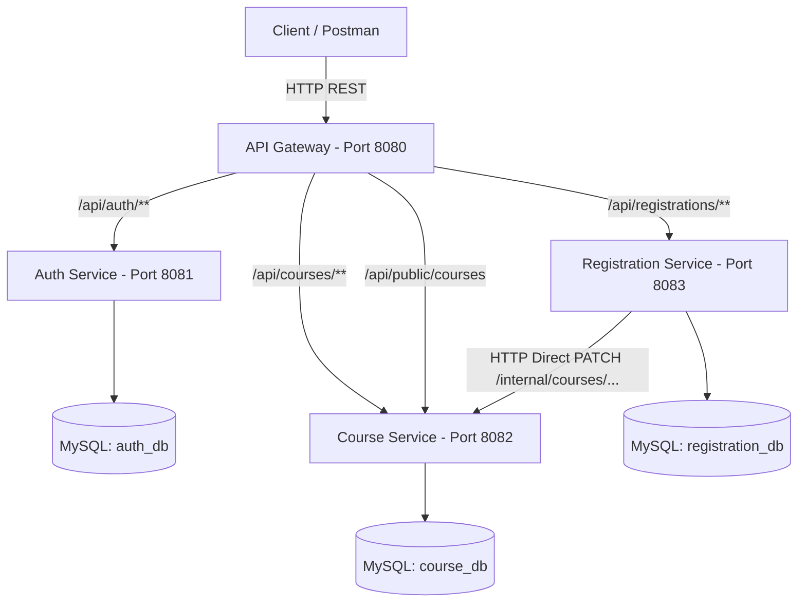

# Owner information
Name : Nguyễn Văn Hiếu
Class : DH13C8

---

## CRS Microservices - Course Registration System (Buổi 4)

Hệ thống Đăng ký Học phần (Course Registration System - CRS) được thiết kế và phát triển dựa trên kiến trúc Microservices, đáp ứng khả năng mở rộng (scalability), cô lập dữ liệu (data isolation) và mô hình bảo mật 2 tầng (2-Layer Security).

---

## Mục lục nội dung
- [Tổng quan Kiến trúc](#tổng-quan-kiến-trúc)
- [Danh sách Microservices](#danh-sách-microservices)
- [Công nghệ sử dụng](#công-nghệ-sử-dụng)
- [Cấu trúc dự án](#cấu-trúc-dự-án)
- [Nguyên tắc Thiết kế & Bảo mật](#nguyên-tắc-thiết-kế--bảo-mật)
- [Định tuyến API Gateway](#định-tuyến-api-gateway)
- [Tổng quan API chính](#tổng-quan-api-chính)
- [Giao tiếp nội bộ giữa các Service](#giao-tiếp-nội-bộ-giữa-các-service)
- [Cấu hình Môi trường (.env)](#cấu-hình-môi-trường-env)
- [Hướng dẫn Khởi chạy](#hướng-dẫn-khởi-chạy)
- [Kịch bản Kiểm thử Cơ bản (Test Flow)](#kịch-bản-kiểm-thử-cơ-bản-test-flow)
- [Trạng thái Phát triển Hiện tại](#trạng-thái-phát-triển-hiện-tại)

---

## Tổng quan Kiến trúc

Hệ thống hiện tại gồm **4 microservices backend** kết nối với **3 cơ sở dữ liệu MySQL riêng biệt**. Mọi truy cập bên ngoài từ Client/Postman đều đi qua **API Gateway** (Cổng 8080) làm điểm vào duy nhất.



---

## Danh sách Microservices

| Service | Port | Database | Trách nhiệm chính |
| :--- | :---: | :---: | :--- |
| **`api-gateway`** | `8080` | *(Không DB)* | Single Entry Point, RewritePath routing, AuthHeaderFilter (Pre-check token existence), ApiKeyFilter (Partner route), CORS |
| **`auth-service`** | `8081` | `auth_db` | Quản lý Người dùng/Sinh viên (`app_user`, `student`), Đăng nhập (`POST /auth/login`), BCrypt password, Seed dữ liệu mẫu, Phát hành JWT |
| **`course-service`** | `8082` | `course_db` | CRUD Môn học, Tìm kiếm & Phân trang, Tự verify JWT & RBAC (ADMIN create/update/delete), Xử lý trừ/hoàn chỗ nội bộ (`/internal/**`) |
| **`registration-service`** | `8083` | `registration_db` | Quản lý Đăng ký học phần, Tự verify JWT, Gọi REST API nội bộ sang `course-service` để giữ/trả chỗ, Quản lý trạng thái (`DA_DANG_KY`, `DA_HUY`) |

---

## Công nghệ sử dụng

- **Backend Framework**: Java 21, Spring Boot 3+, Spring Cloud Gateway (WebFlux), Spring Security, Spring Data JPA
- **Authentication & Security**: JSON Web Token (`jjwt`), BCrypt Password Encoder
- **Database**: MySQL 8.x (Áp dụng pattern *Database per Service*)
- **Inter-service Call**: Spring `RestTemplate` (Synchronous HTTP call)
- **DevOps & Tooling**: Maven, `.env` Configuration management

---

## Cấu trúc dự án

```text
crs-microservices/
├── api-gateway/          # Microservice API Gateway (Port 8080)
├── auth-service/         # Microservice Authentication & User (Port 8081)
├── course-service/       # Microservice Course Management (Port 8082)
├── registration-service/ # Microservice Registration Management (Port 8083)
├── crs-frontend/         # Frontend Web Application (Port 3000)
├── docs/                 # Tài liệu thiết kế hệ thống & Blueprint API
│   ├── blueprint-api.md                 # Chi tiết Hợp đồng API (API Contracts)
│   └── thiet-ke-bien-gioi-service.md    # Thiết kế ranh giới Service & Ownership
├── .env                  # Cấu hình biến môi trường dùng chung
├── .gitignore            # Cấu hình loại trừ Git
└── README.md             # Tài liệu tổng quan hệ thống
```

---

## Nguyên tắc Thiết kế & Bảo mật

1. **Cô lập Dữ liệu (Data Isolation)**:
   - Mỗi microservice sở hữu một Database độc lập (`auth_db`, `course_db`, `registration_db`).
   - Không có truy vấn chéo cơ sở dữ liệu (No cross-database query) và không có JPA Relationship xuyên service.
   - Các service tham chiếu dữ liệu của nhau thông qua ID (như `studentId`, `courseId`).

2. **Mô hình Bảo mật 2 Tầng (2-Layer Security)**:
   - **Tầng 1 - API Gateway**: 
     - Sơ kiểm sự tồn tại của header `Authorization` đối với các protected routes (trả ngay `401 Unauthorized` nếu thiếu).
     - Kiểm tra header `X-API-KEY` đối với đối tác tại route `/api/public/courses` (trả ngay `403 Forbidden` nếu thiếu/sai key).
     - *Gateway không thực hiện giải mã và xác thực chi tiết nội dung JWT.*
   - **Tầng 2 - Business Services (`course-service`, `registration-service`)**:
     - Mỗi service tích hợp `JwtAuthFilter` để tự giải mã, xác minh tính hợp lệ của JWT và trích xuất `username`/`role`.
     - `course-service` thực thi Phân quyền theo vai trò (RBAC): Chỉ `ADMIN` mới được gọi `POST`, `PUT`, `DELETE /courses/**`.

---

## Định tuyến API Gateway

Tất cả các request từ Client đi qua Gateway `:8080` được định tuyến lại (RewritePath) như sau:

| Route External (Client gọi) | Target Internal Service | Điều kiện Bảo mật |
| :--- | :--- | :--- |
| `POST /api/auth/login` | `http://localhost:8081/auth/login` | Public (Không cần JWT) |
| `GET /api/courses/**` | `http://localhost:8082/courses/**` | Public (Không cần JWT) |
| `POST, PUT, DELETE /api/courses/**` | `http://localhost:8082/courses/**` | Gateway: Cần `Authorization`<br>Course-service: Cần Role `ADMIN` |
| `POST, GET, DELETE /api/registrations/**` | `http://localhost:8083/registrations/**` | Gateway: Cần `Authorization`<br>Registration-service: Authenticated (`ADMIN`/`STUDENT`) |
| `GET /api/public/courses` | `http://localhost:8082/courses` | Yêu cầu Header `X-API-KEY` |

> [!IMPORTANT]
> Gateway **không định tuyến** bất kỳ đường dẫn `/internal/**` nào ra bên ngoài. Các API `/internal/**` hoàn toàn bị cô lập trong mạng nội bộ.

---

## Tổng quan API chính

> Xem chi tiết contract đầy đủ tại [docs/blueprint-api.md](file:///D:/crs-microservices/docs/blueprint-api.md).

- **Xác thực**: `POST /api/auth/login`
- **Môn học (Public)**: `GET /api/courses`, `GET /api/courses/{id}`
- **Quản lý Môn học (ADMIN)**: `POST /api/courses`, `PUT /api/courses/{id}`, `DELETE /api/courses/{id}`
- **Đăng ký Học phần**: `POST /api/registrations`, `GET /api/registrations/student/{studentId}`, `DELETE /api/registrations/{id}`
- **API Đối tác (Partner)**: `GET /api/public/courses` (với Header `X-API-KEY: crs-partner-key-2026`)

---

## Giao tiếp nội bộ giữa các Service

Khi xử lý nghiệp vụ Đăng ký hoặc Hủy đăng ký, `registration-service` sẽ gọi trực tiếp HTTP REST API sang `course-service`:

1. **Đăng ký môn học (`POST /api/registrations`)**:
   - `registration-service` kiểm tra đăng ký trùng lặp trong `registration_db`.
   - Gọi `PATCH http://localhost:8082/internal/courses/{id}/reserve-seat`.
   - `course-service` kiểm tra số chỗ còn lại (`soChoConLai > 0`), giảm đi 1 chỗ và lưu DB.
   - `registration-service` lưu bản ghi đăng ký với trạng thái `DA_DANG_KY`.

2. **Hủy đăng ký học phần (`DELETE /api/registrations/{id}`)**:
   - `registration-service` kiểm tra bản ghi đăng ký.
   - Gọi `PATCH http://localhost:8082/internal/courses/{id}/release-seat`.
   - `course-service` tăng `soChoConLai` lên 1 (nếu nhỏ hơn `soChoToiDa`).
   - `registration-service` cập nhật trạng thái bản ghi thành `DA_HUY`.

---

## Cấu hình Môi trường (.env)

```env
# Database Credentials
DB_USERNAME=root
DB_PASSWORD=your_mysql_password

# Port Configurations
API_GATEWAY_PORT=8080
AUTH_SERVICE_PORT=8081
COURSE_SERVICE_PORT=8082
REGISTRATION_SERVICE_PORT=8083

# JWT Security
JWT_SECRET=CRS-Microservices-Secret-Key-Nam-3-Hoc-Ky-2026-Doi-Trong-Thuc-Te
JWT_EXPIRATION=86400000

# Partner API Key
PARTNER_API_KEY=crs-partner-key-2026
```

---

## Hướng dẫn Khởi chạy (Local Development)

### 1. Khởi tạo Database MySQL
```sql
CREATE DATABASE IF NOT EXISTS auth_db;
CREATE DATABASE IF NOT EXISTS course_db;
CREATE DATABASE IF NOT EXISTS registration_db;
```

### 2. Khởi chạy 4 Microservices Backend
Mở 4 cửa sổ Terminal riêng biệt cho từng service và khởi chạy:

```bash
# 1. Auth Service (Port 8081)
cd auth-service && ./mvnw spring-boot:run

# 2. Course Service (Port 8082)
cd course-service && ./mvnw spring-boot:run

# 3. Registration Service (Port 8083)
cd registration-service && ./mvnw spring-boot:run

# 4. API Gateway (Port 8080)
cd api-gateway && ./mvnw spring-boot:run
```

---

## Kịch bản Kiểm thử Cơ bản (Test Flow)

Dưới đây là tập hợp các test case đã verified hoạt động chính xác trên hệ thống:

1. **Đăng nhập lấy Token (Admin & Student)**:
   - `POST http://localhost:8080/api/auth/login` với body `{"username": "admin", "password": "admin123"}` $\rightarrow$ **200 OK** (trả về JWT role ADMIN).
   - `POST http://localhost:8080/api/auth/login` với body `{"username": "student1", "password": "student123"}` $\rightarrow$ **200 OK** (trả về JWT role STUDENT).

2. **Xem danh sách môn học không dùng Token**:
   - `GET http://localhost:8080/api/courses` $\rightarrow$ **200 OK** (Public access).

3. **Tạo môn học không có Authorization Header**:
   - `POST http://localhost:8080/api/courses` $\rightarrow$ **401 Unauthorized** (Chặn tại Gateway).

4. **Tạo môn học dùng Token của STUDENT**:
   - `POST http://localhost:8080/api/courses` kèm `Authorization: Bearer <STUDENT_TOKEN>` $\rightarrow$ **403 Forbidden** (Chặn tại `course-service`).

5. **Tạo môn học dùng Token của ADMIN**:
   - `POST http://localhost:8080/api/courses` kèm `Authorization: Bearer <ADMIN_TOKEN>` $\rightarrow$ **201 Created**.

6. **Đăng ký môn học bằng Token STUDENT**:
   - `POST http://localhost:8080/api/registrations` với body `{"studentId": 1, "courseId": 11}` kèm `Authorization: Bearer <STUDENT_TOKEN>` $\rightarrow$ **201 Created**. (Số chỗ còn lại của môn học 11 tự động giảm từ 30 xuống 29).

7. **Gọi Partner API với X-API-KEY hợp lệ**:
   - `GET http://localhost:8080/api/public/courses` kèm Header `X-API-KEY: crs-partner-key-2026` $\rightarrow$ **200 OK**.

8. **Gọi Partner API thiếu hoặc sai X-API-KEY**:
   - `GET http://localhost:8080/api/public/courses` không có Header `X-API-KEY` $\rightarrow$ **403 Forbidden** (Chặn tại Gateway).

---

## Trạng thái Phát triển Hiện tại

- [x] Tách biệt hoàn toàn Database per Service (`auth_db`, `course_db`, `registration_db`).
- [x] Xây dựng API Gateway với Spring Cloud Gateway (WebFlux).
- [x] Áp dụng mô hình Bảo mật 2 Tầng (Gateway pre-check & Service self-JWT verification).
- [x] Phân quyền RBAC tại `course-service` (ADMIN / PUBLIC).
- [x] Triển khai Partner route bảo mật bằng `X-API-KEY`.
- [x] Triển khai giao tiếp HTTP REST giữa `registration-service` và `course-service` để giữ/trả chỗ tự động.
