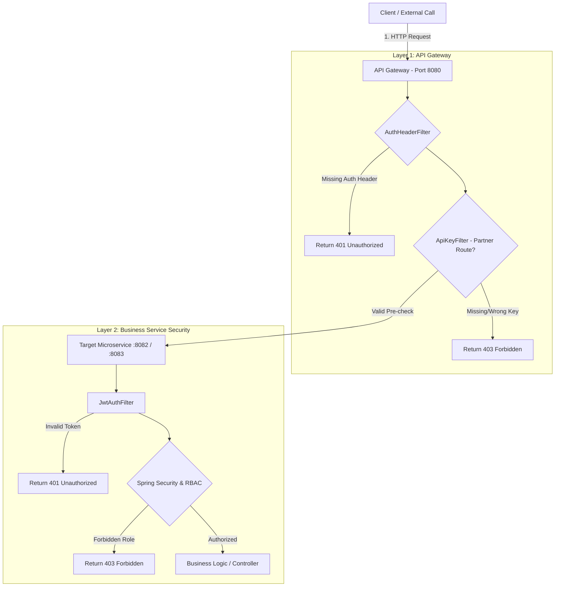
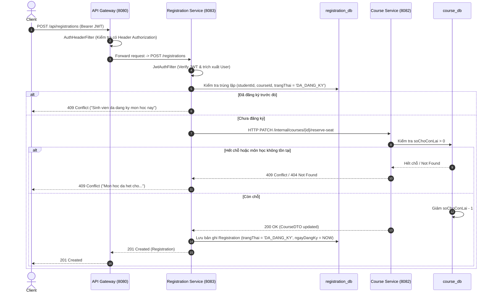
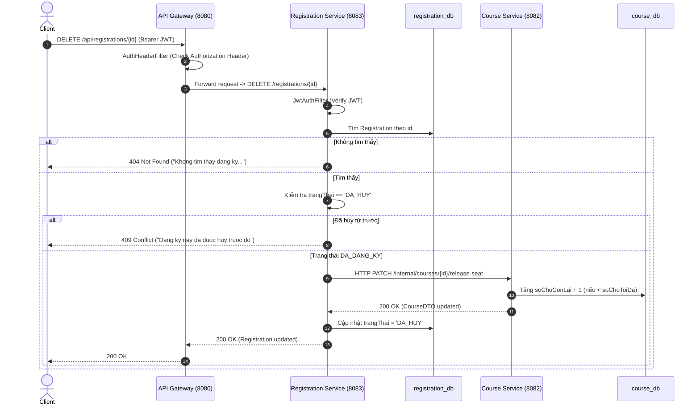
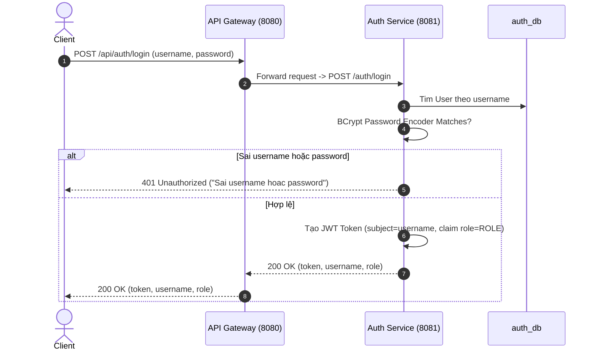
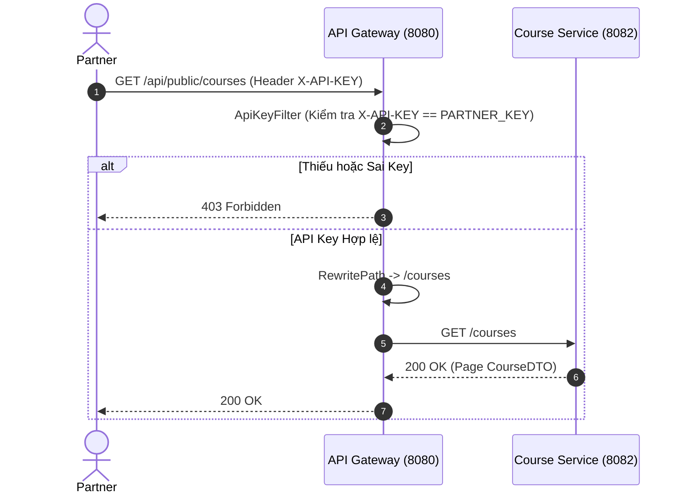

# Thiết kế Biên giới Service & Kiến trúc Ranh giới (Service Boundary Design)

Tài liệu này quy định kiến trúc ranh giới (Service Boundary), quyền sở hữu dữ liệu (Data Ownership), cơ chế giao tiếp giữa các service (Inter-Service Communication) và mô hình bảo mật của hệ thống CRS Microservices sau Buổi 4.

---

## 1. Danh sách Service & Quyền sở hữu Dữ liệu (Data Ownership)

Hệ thống được thiết kế theo nguyên tắc **Database per Service**. Mỗi Microservice quản lý một cơ sở dữ liệu hoàn toàn độc lập, đảm bảo tính cô lập dữ liệu (data isolation) và độc lập trong triển khai.

| Service | Port | Database | Data Entities Owned | Trách nhiệm chính |
| :--- | :---: | :---: | :--- | :--- |
| **`api-gateway`** | `8080` | *(Không DB)* | *(Không sở hữu dữ liệu)* | Single Entry Point cho Client, định tuyến (RewritePath), CORS, kiểm tra Authorization header sơ bộ (Layer 1), kiểm tra Partner API Key. |
| **`auth-service`** | `8081` | `auth_db` | - `User` (`app_user`)  - `Student` (`student`) | Quản lý người dùng, sinh viên, tài khoản, mã hóa mật khẩu BCrypt, seed dữ liệu mẫu, đăng nhập (`/auth/login`) và phát hành JWT Token. |
| **`course-service`** | `8082` | `course_db` | - `Course` (`course`) | Quản lý thông tin môn học, tìm kiếm & phân trang, quản lý số chỗ (`soChoToiDa`, `soChoConLai`), tự verify JWT & phân quyền RBAC (ADMIN), cung cấp API nội bộ điều phối chỗ. |
| **`registration-service`**| `8083` | `registration_db` | - `Registration` (`registration`) | Quản lý lịch sử và trạng thái đăng ký môn học (`DA_DANG_KY`, `DA_HUY`), tự verify JWT, thực hiện cuộc gọi REST nội bộ sang `course-service` để giữ/trả chỗ. |

---

## 2. Các Quy tắc Ranh giới Cốt lõi (Core Boundary Rules)

1. **Không Truy vấn Chéo Cơ sở Dữ liệu (No Cross-Database Query)**:
   - `registration-service` tuyệt đối không được đọc/ghi trực tiếp vào `course_db` hay `auth_db`.
   - `course-service` tuyệt đối không được đọc/ghi vào `auth_db` hay `registration_db`.

2. **Không Thiết lập Quan hệ JPA xuyên Service (No Cross-Service JPA Relationships)**:
   - Các Entity như `Registration` không dùng các annotation `@ManyToOne` hay `@OneToOne` tới `Course` hay `Student`.
   - Tất cả các liên kết giữa các miền dữ liệu chỉ được lưu dưới dạng **ID đơn thuần** (ví dụ: `studentId`, `courseId`).

3. **Giao tiếp qua Hợp đồng REST API (Communication via REST APIs)**:
   - Mọi sự trao đổi thông tin hoặc thay đổi trạng thái giữa các service bắt buộc phải đi qua HTTP REST API chính thức.
   - Ví dụ: Khi sinh viên đăng ký, `registration-service` bắt buộc phải gọi sang `course-service` bằng HTTP `PATCH` để giữ chỗ.

4. **Ranh giới API Nội bộ (Internal API Boundary)**:
   - Các API có tiền tố `/internal/**` (ví dụ: `/internal/courses/{id}/reserve-seat`) được định nghĩa dành riêng cho giao tiếp server-to-server.
   - API Gateway **không bao giờ cấu hình route** cho đường dẫn `/internal/**`. Do đó, Client bên ngoài không thể trực tiếp gọi tới các API nội bộ này.

5. **Mô hình Bảo mật Nhân bản Tự chủ (Deliberate Security Duplication)**:
   - `JwtAuthFilter` được triển khai tại cả `course-service` và `registration-service`.
   - Đây là sự trùng lặp cố ý (deliberate duplication) nhằm đảm bảo nguyên tắc Zero Trust: Mỗi business service tự bảo vệ tài nguyên của mình bằng cách tự giải mã và kiểm tra tính hợp lệ của JWT, không phụ thuộc hoàn toàn vào API Gateway.

---

## 3. Ranh giới Bảo mật 2 Tầng (2-Layer Security Boundary)

- **Tầng 1 (Gateway Boundary)**:
  - `AuthHeaderFilter`: Kiểm tra sự tồn tại của header `Authorization` đối với các protected routes (`POST/PUT/DELETE /api/courses`, `/api/registrations/**`). Nếu không có, phản hồi ngay `401 Unauthorized`.
  - `ApiKeyFilter`: Kiểm tra header `X-API-KEY` tại route `/api/public/courses`. Nếu sai hoặc thiếu key, phản hồi ngay `403 Forbidden`.
- **Tầng 2 (Service Boundary)**:
  - `JwtAuthFilter`: Tự xác minh chữ ký HMAC-SHA256 của JWT bằng `JWT_SECRET`, giải mã `username` và `role`.
  - `SecurityConfig` tại `course-service`: Yêu cầu Role `ADMIN` cho các hành động chỉnh sửa môn học (`POST/PUT/DELETE`).

---

## 4. Các Luồng Nghiệp vụ Hệ thống (System Flow Diagrams)

### Flow 1: Luồng Đăng ký Học phần (Course Registration Flow)

---

### Flow 2: Luồng Hủy Đăng ký Học phần (Course Cancellation Flow)

---

### Flow 3: Luồng Đăng nhập & Xác thực JWT (JWT Authentication Flow)

---

### Flow 4: Luồng API Đối tác (Partner API Flow)

